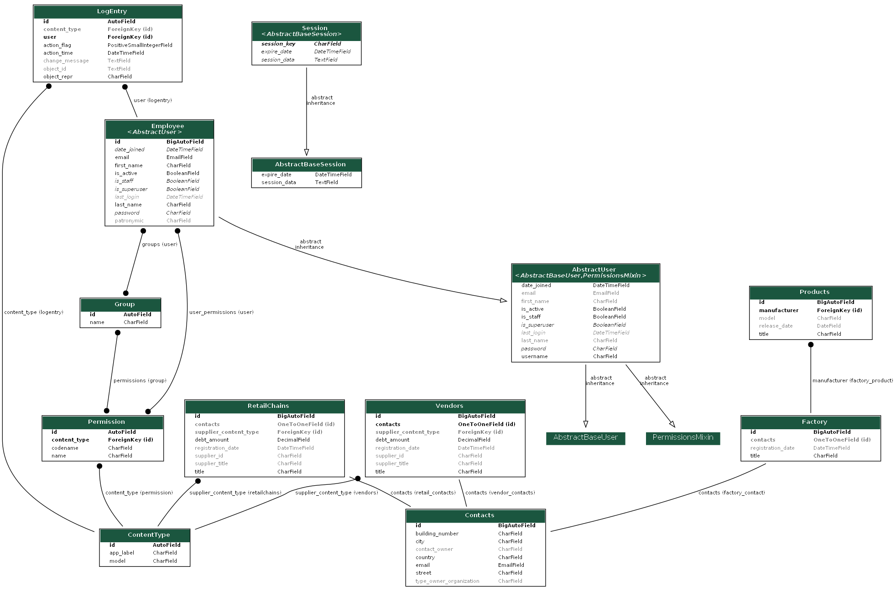
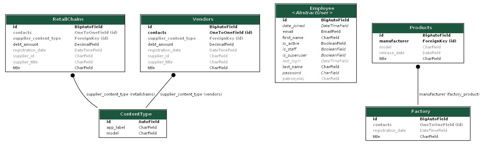

# electronics_retail_chain_API
Данный проект представляет собой разработку API для иерархической сети продаж электроники, 
включающей модели продавцов, продуктов и сотрудников.

## Стек технологий:
- python 
- django
- djangorestframework
- djangorestframework-simplejwt
- psycopg2-binary
- django-filter
- drf-yasg
- flake8
- python-dotenv
- django-extensions
- ipython
- pyparsing
- pydot


## Установка
Прежде чем начать использовать Marketplace API, убедитесь, что у вас установлен 
интерпретатор Python c версией не ниже 3.9:

Клонируйте репозиторий с помощью следующей команды:
   ```bash
   git clone git@github.com:Abramov0Alexandr/electronics_retail_chain_API.git
   ```

Перейдите в директорию проекта:
   ```bash
   cd electronics_retail_chain_API
   ```

Активируйте виртуальное окружение Poetry и установите зависимости:

   ```bash
   poetry init
   poetry shell
   poetry install
   ```

Создайте и примените миграции для базы данных:

   ```bash
   python manage.py makemigrations
   python manage.py migrate
   ```


Запустите сервер:
   ```bash
   python manage.py runserver
   ```

Теперь приложение доступно по адресу http://localhost:8000/.


## Регистрация
Для регистрации в сервисе необходимо отправить POST-запрос на эндпоинт http://localhost:8000/api/employee/create/. 

Пример создания нового пользователя:

<pre>
<code>
{
    "password":"123654",
    "first_name":"alex",
    "last_name":"abramov",
    "email":"alex@abramov.ru"
}
</code>
</pre>

## Создание объекта модели Factory
Для регистрации в сервисе необходимо отправить POST-запрос на эндпоинт http://localhost:8000/api/factories/create/. </br>
Объект модели Factory (Завод) может быть зарегистрирован только в качестве поставщика и только он может производить товары.

Пример создания нового объекта:

<pre>
<code>
{    
    "title":"Красный октябрь",
    "contacts":{
        "email":"krasniy_oktabr@mail.ru",
        "country":"Россия",
        "city":"Волгоград",
        "street":"проспект Ленина",
        "building_number":"10"
    }
}
</code>
</pre>


## Создание объекта модели RetailChains
Для регистрации в сервисе необходимо отправить POST-запрос на эндпоинт http://localhost:8000/api/retail_chain/create/. </br>
Объект модели RetailChains (Розничная сеть) может быть зарегистрирован как в качестве поставщика, так и в качестве заказчика.

Пример создания нового объекта в качестве поставщика:

<pre>
<code>
{    
    "title":"Магнит",
    "contacts":{
        "email":"magnit@mail.ru",
        "country":"Россия",
        "city":"Волгоград",
        "street":"площадь Дзержинского",
        "building_number":"2а"
    }
}
</code>
</pre>

**Важно**: у Розничной сети выбор поставщика ограничен Заводом и Индивидуальным предпринимателем.<br>
Для выбора типа поставщика используется поле "supplier_content_type" (9: для связи с ИП, 11: для связи с Заводом). <br>
Далее, для выбора конкретного поставщика необходимо указать его id.

Пример создания нового объекта в качестве заказчика с указанием поставщика: <br>

<pre>
<code>
{   
    "title":"Покупочка",
    "supplier_content_type":"11",
    "supplier_id":"1",
    "contacts":{
            "email":"pokupochka@mail.ru",
            "country":"Россия",
            "city":"Волгоград",
            "street":"Вишневая",
            "building_number":"4"
            }
}
</code>
</pre>


## Создание объекта модели Vendors
Для регистрации в сервисе необходимо отправить POST-запрос на эндпоинт http://localhost:8000/api/vendor/create/. </br>
Объект модели Vendors (Индивидуальный предприниматель) может быть зарегистрирован как в качестве поставщика, так и в качестве заказчика.

Пример создания нового объекта в качестве поставщика:

<pre>
<code>
{    
    "title":"ИП Зайцев",
    "contacts":{
        "email":"zaycev@mail.ru",
        "country":"Россия",
        "city":"Волгоград",
        "street":"ул. им. Лодыгина",
        "building_number":"93"
        }
}
</code>
</pre>

**Важно**: у Индивидуального предпринимателя выбор поставщика ограничен Розничной сетью и Заводом.<br>
Для выбора типа поставщика используется поле "supplier_content_type" (10: для связи с Розничной сетью, 11: для связи с Заводом). <br>
Далее, для выбора конкретного поставщика необходимо указать его id.

Пример создания нового объекта в качестве заказчика с указанием поставщика: <br>

<pre>
<code>
{    
    "title":"ИП Иванов",
    "supplier_content_type":"10",
    "supplier_id":"1",
    "contacts":{
        "email":"ivanov@mail.ru",
        "country":"Россия",
        "city":"Волгоград",
        "street":"Волжской флотилии",
        "building_number":"27"
        }
}
</code>
</pre>


## Возможности API
Наш проект предоставляет следующие возможности через API:

 - Регистрация новых пользователей.
 - Авторизация пользователей.
 - Получение JWT-токенов для аутентификации.
 - Создание объектов сети продаж, как в качестве поставщиков, так и в качестве заказчиков.
 - Получение списка объектов торговой сети, с указанием контактной информации поставщика и его полной информации.
 - Редактирование и удаление объектов сети продаж.
 - Создание новых продуктов.
 - Получение списка всех товаров их редактирование и удаление. 


## Схемы моделей и их взаимосвязи
Полная схема моделей



Схема кастомных моделей




## Документация
Документацию к API вы можете найти перейдя по следующим ссылкам:<br>
http://127.0.0.1:8000/api/swagger/ <br>
http://127.0.0.1:8000/api/redoc/


## Лицензия
Electronics retail chain_API распространяется по [MIT License](https://opensource.org/licenses/MIT).

## Контакты

Спасибо за использование Electronics retail chain_API! Если у вас есть какие-либо вопросы или предложения, не стесняйтесь обращаться к нам.

Автор: [Alexandr Abramov <https://github.com/Abramov0Alexandr>]

Связь: [alexandr.abramovv@gmail.com <https://github.com/Abramov0Alexandr>]

GitHub: [https://github.com/Abramov0Alexandr]
